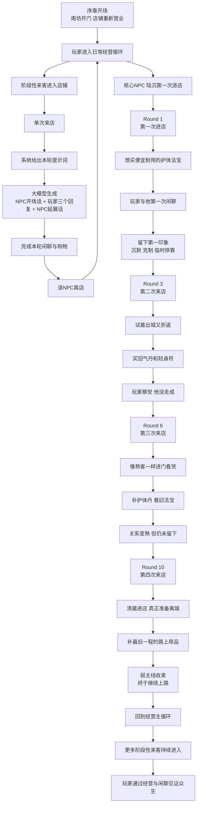
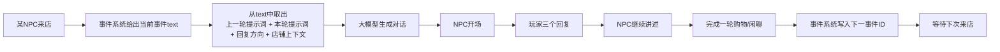
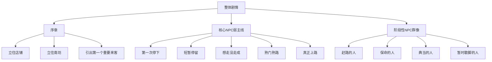

# 整体剧情流程图（经营叙事版）

## 一、整体结构



---

## 二、单轮玩法循环



---

## 三、剧情层级



---

## 四、阅读版简图

```text
序章
  -> 南坊开门
  -> 玩家接手日常经营
  -> 第一个重要来客出现

日常经营主循环
  -> 来客进店
  -> 事件系统给出本轮提示词
  -> 大模型生成闲聊
  -> 玩家回复
  -> NPC继续讲述
  -> 完成购买/离店
  -> 写入下一轮事件

核心NPC（陆沉示例）
  -> 第一次来店：临时停靠，只买够继续走下去的东西
  -> 第二次来店：试着离城又折返
  -> 第三次来店：像熟客一样回来看货
  -> 第四次来店：真正准备上路
  -> 收束：他离开，但店铺留在他的路上

阶段性NPC
  -> 不承担强主线
  -> 负责南坊烟火气和世界横截面
  -> 每个人只提供一小段人生切面
```

---

## 五、这一版剧情的核心感受

不是：

- 玩家破解大案
- 玩家打出最优分支
- 所有NPC互相咬合推进世界结局

而是：

- 玩家守着店
- 看一些人带着各自的问题进门
- 通过一次次来店，看出他们慢慢变了
- 最后意识到，自己见证了一段路
